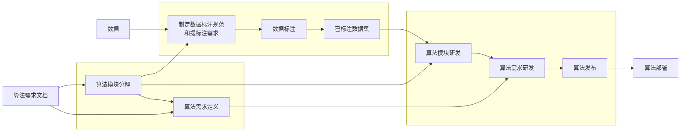

梳理了一下计算机视觉算法的研发流程:

```mermaid
graph LR
    node[制定数据标注规范</br>和提标注需求]

    subgraph  
        算法模块分解 --> 算法需求定义
    end

    subgraph  
        node --> 数据标注 --> 已标注数据集
    end

    subgraph  
        算法模块研发 --> 算法需求研发
        算法需求研发 --> 算法发布
    end

    数据 --> node

    算法需求文档 --> 算法模块分解
    算法需求文档 --> 算法需求定义

    已标注数据集 --> 算法模块研发
    算法模块分解 --> node
    算法模块分解 --> 算法模块研发
    算法需求定义 --> 算法需求研发
    
    算法发布 --> 算法部署
```

